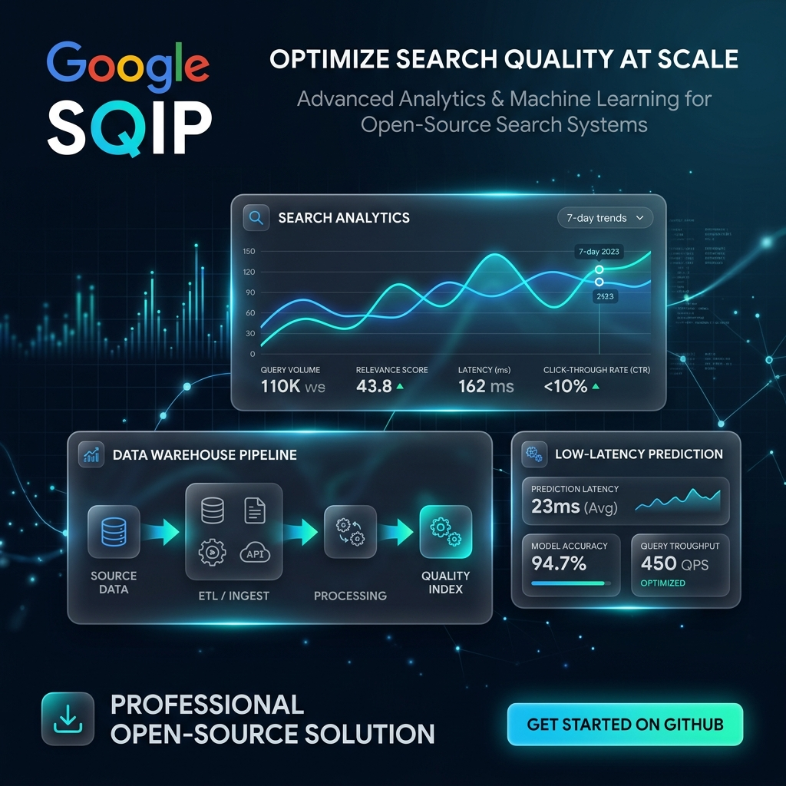
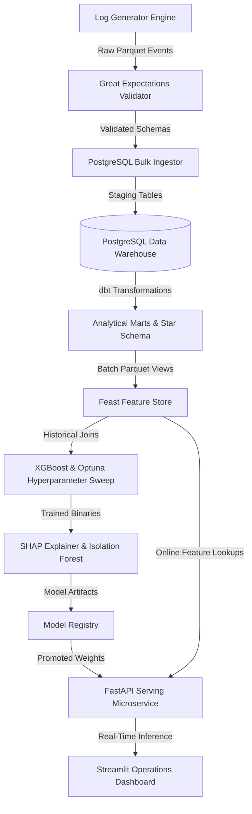
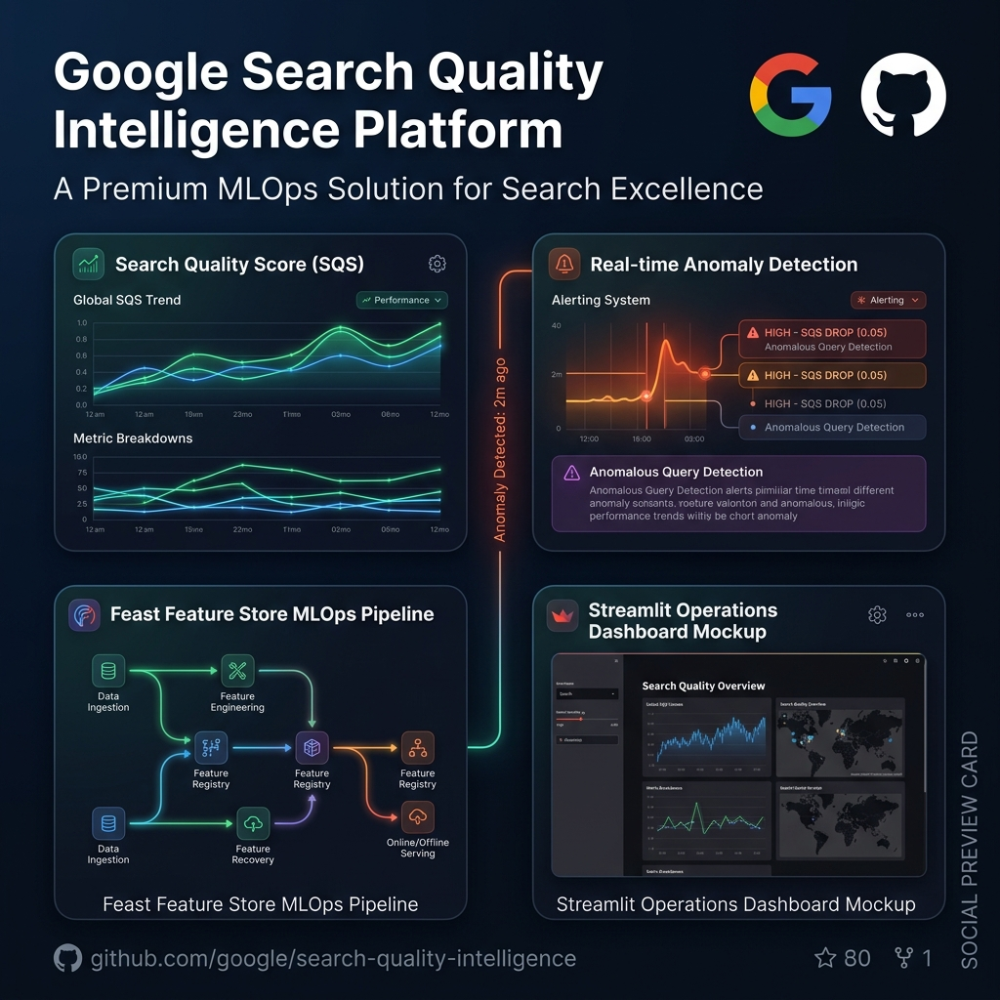

# Search Quality Intelligence Platform (SQIP)

> **Production-Grade Analytics Engineering & MLOps Engine for Silent Search Quality Degradation Detection**

[](https://github.com/YOUR_USERNAME/sqip/actions)
[](https://www.python.org/)
[](https://www.postgresql.org/)
[](https://www.getdbt.com/)
[](https://feast.dev/)
[](LICENSE)
[](https://github.com/psf/black)

[Documentation](https://YOUR_USERNAME.github.io/sqip/) • [Live Dashboard](http://localhost:8501) • [API Reference](http://localhost:8000/docs) • [Architecture Specs](docs/architecture/system_design.md) • [Interview Kit](docs/portfolio/interview_kit.md)

---



---

## Executive Overview

The **Search Quality Intelligence Platform (SQIP)** is an open-source analytics engineering and MLOps platform engineered to detect, diagnose, and alert on micro-degradations in search result relevance and system performance before end users experience friction.

### The Problem: Silent Search Quality Regressions
Modern search infrastructure returns HTTP `200 OK` status codes even when search result relevance degrades. Silent regressions—such as a 2.5% drop in Click-Through Rate (CTR) for mobile users in Asia-Pacific, unexpected pogo-sticking spikes, or ranking shifts following algorithm deployments—are invisible to traditional infrastructure monitoring tools like Prometheus and Datadog.

### The Solution
SQIP correlates **technical infrastructure telemetry** (server response latency, page speed scores, geographic datacenter region) with **user engagement signals** (dwell time, CTR, pogo-sticking rate, query reformulation) within a unified data warehouse and feature store. Using an XGBoost regressor with Optuna hyperparameter optimization, SHAP feature attributions, and an Isolation Forest anomaly classifier, SQIP computes a predictive **Search Quality Score (SQS)** and serves real-time inference via an asynchronous FastAPI microservice.

---

## Key Platform Capabilities

### 1. Data Engineering & Synthetic Generation
- **Multi-Dimensional Search Log Generator**: Vectorized log generator producing millions of search events with parameterized user behaviors, network indicators, and device metadata.
- **Embedded Anomaly Injections**: Simulates real-world incidents (e.g., regional mobile latency spikes, query intent shifts) for pipeline validation.

### 2. Data Quality & Automated Validation
- **Great Expectations Integration**: Ingestion pipeline automatically executes schema and metric distribution assertions (`validate_data.py`) before staging records in the warehouse.

### 3. Analytics Engineering & Data Warehouse
- **PostgreSQL Star Schema**: Dimensional warehouse model (`fct_search_events`, `dim_users`, `dim_queries`, `dim_systems`, `dim_geography`) optimized for OLAP aggregations.
- **dbt Core Models**: Modular SQL transformations for dimensional modeling, surrogate key generation, and incremental fact builds.

### 4. MLOps Feature Store
- **Feast Integration**: Dual offline (Parquet) and low-latency online (SQLite/Redis) feature stores (`src/features/`).
- **Point-in-Time Correctness**: Eliminates data leakage during training set generation via Feast historical feature joins.

### 5. Machine Learning & Interpretability
- **Predictive SQS Regressor**: XGBoost model predicting Search Quality Scores from technical and behavioral features.
- **Automated Hyperparameter Sweep**: Optuna optimization tuning tree depth, learning rate, and subsample ratios.
- **Model Explainability & Anomaly Alerts**: SHAP value feature attributions identifying root causes and Isolation Forest outlier detection.

### 6. Serving Microservice & Operations Portal
- **Asynchronous FastAPI Server**: Production serving endpoints (`src/serving/api.py`) delivering predictions with sub-25ms latency SLAs.
- **Streamlit Operations Center**: Multi-page operations dashboard (`src/dashboard/app.py`) presenting real-time telemetry, anomaly maps, and inference playgrounds.

---

## Architecture & Data Flow



### End-to-End Data Flow Description
1. **Event Ingestion & Validation**: Raw search logs generated in Parquet format are validated by Great Expectations (`validate_data.py`) to enforce non-null constraints and metric boundaries.
2. **Warehouse Ingestion**: Validated events are ingested into a PostgreSQL relational data warehouse (`ingest_dw.py`) using transaction-safe bulk `COPY` operations.
3. **dbt Transformation**: dbt Core models transform raw staging records into conformed dimension tables and `fct_search_events` fact tables.
4. **Feature Store Materialization**: Feast compiles feature definitions (`src/features/definitions.py`) and materializes rolling metrics (7-day CTR, 30-day dwell time, query 95p latency) into the online lookup store.
5. **Training & Explainability**: The training pipeline (`train_model.py`) executes Optuna sweeps to train an XGBoost regressor. Model explainability rules (`explain_model.py`) extract SHAP feature attributions and train an Isolation Forest anomaly classifier.
6. **Serving & Dashboarding**: The FastAPI microservice (`src/serving/api.py`) handles real-time scoring requests using Feast online feature lookups, displaying operational telemetry in the Streamlit Operations Dashboard (`src/dashboard/app.py`).

---

## Technology Stack

| Layer | Technology | Purpose |
| :--- | :--- | :--- |
| **Language** | Python 3.10 / 3.11 / 3.12 | Core application runtime & pipeline scripting |
| **Data Warehouse** | PostgreSQL 15 | Relational star-schema analytical warehouse |
| **Transformation** | dbt Core 1.8+ | Modular SQL transformations & data modeling |
| **Data Validation** | Great Expectations | Automated schema & statistical distribution assertions |
| **Feature Store** | Feast | MLOps online/offline feature store & point-in-time joins |
| **Machine Learning** | XGBoost / Optuna / Scikit-Learn | Predictive regressor & hyperparameter tuning |
| **Model Interpretability** | SHAP | Tree SHAP feature attribution & root cause analysis |
| **Serving API** | FastAPI / Uvicorn | Asynchronous low-latency prediction microservice |
| **Dashboard** | Streamlit | Multi-page operational telemetry & inference UI |
| **Automation** | GNU Make | Standardized developer workflow shortcuts |
| **Containerization** | Docker / Docker Compose | Multi-stage production container orchestration |
| **Testing & Quality** | Pytest / Mypy / Ruff / Black | Unit testing, type checking, linting, and formatting |
| **Documentation** | MkDocs / Material for MkDocs | Documentation site generation |

---

## Repository Layout Map

```
.
├── Dockerfile                   # Multi-stage container build specifications
├── Makefile                     # Developer automation shortcuts
├── README.md                    # Platform landing page & quickstart
├── docker-compose.yml           # Multi-container orchestration (DB, API, Dashboard)
├── requirements.txt             # Pinned Python package dependencies
├── pyproject.toml               # Package configuration & tool settings (pytest, black, mypy)
├── .env.example                 # Environment variable template
├── configs/                     # Application YAML configurations
│   ├── base_config.yaml         # Base environment settings
│   └── dev_config.yaml          # Local development overrides
├── dags/                        # Apache Airflow orchestration DAGs
│   └── search_quality_dag.py
├── data/                        # Raw Parquet log files & feature data stores
├── docs/                        # Comprehensive documentation & architecture specs
│   ├── architecture/            # System design & data flow documentation
│   ├── portfolio/               # Executive summaries, case studies & interview kits
│   └── prd/                     # Product requirements documentation
├── models/                      # Trained model registry & serialized binaries
├── sql/                         # Database DDL scripts & star schema specifications
├── src/                         # Core Python codebase
│   ├── config/                  # Configuration loader singleton
│   ├── data/                    # Log generation & DW ingestion modules
│   ├── features/                # Feast Feature Store definitions & materialization
│   ├── models/                  # ML training, Optuna tuning & SHAP explainability
│   ├── serving/                 # FastAPI microservice endpoints
│   └── dashboard/               # Streamlit operational dashboard application
└── tests/                       # Automated Pytest suite
```

---

## Quick Start

### Prerequisites
- [Docker & Docker Compose](https://docs.docker.com/get-docker/) (Recommended)
- Python 3.10, 3.11, or 3.12 (For local CLI development)

### Option A: Single-Command Docker Cluster (Recommended)

Launch the full platform (PostgreSQL Warehouse, FastAPI Serving Microservice, and Streamlit Operations Dashboard) with a single command:

```bash
# 1. Clone repository
git clone https://github.com/YOUR_USERNAME/sqip.git
cd sqip

# 2. Copy environment template
cp .env.example .env

# 3. Build and launch containers
docker compose up --build
```

#### Access Endpoints
- **Streamlit Operations Dashboard**: [http://localhost:8501](http://localhost:8501)
- **FastAPI OpenAPI Documentation**: [http://localhost:8000/docs](http://localhost:8000/docs)
- **PostgreSQL Warehouse**: `localhost:5432` (`database: search_quality`, `user: postgres`)

---

### Option B: Local Python Developer Workflow

```bash
# 1. Setup environment & install dependencies
git clone https://github.com/YOUR_USERNAME/sqip.git
cd sqip
pip install -r requirements.txt

# 2. Run environment bootstrap check
make bootstrap

# 3. Generate raw search logs & validate schemas
make generate
make validate

# 4. Ingest conformed dimensional tables into PostgreSQL
make ingest

# 5. Compile & materialize Feast Feature Store metrics
make features

# 6. Train XGBoost model regressor & compute SHAP attributions
make train
make explain

# 7. Launch FastAPI microservice (Terminal 1)
uvicorn src.serving.api:app --host 0.0.0.0 --port 8000 --reload

# 8. Launch Streamlit Operations Dashboard (Terminal 2)
streamlit run src/dashboard/app.py
```

---

## Screenshots & Platform Previews

### Streamlit Operations Dashboard

*Interactive operational metrics, global latency maps, and real-time prediction playgrounds.*

### FastAPI OpenAPI Serving Specs

*Asynchronous RESTful serving endpoints delivering predictions with sub-25ms latency.*

---

## Technical Documentation & Case Studies

Detailed technical deep-dives and portfolio guides are available in `docs/`:

- [System Design Architecture](docs/architecture/system_design.md) — Technical component specs and data flows.
- [Product Requirements Document (PRD)](docs/prd/prd.md) — Business rationale and metric definitions.
- [Executive Summary](docs/portfolio/executive_summary.md) — High-level briefing, ROI, and business impact.
- [Architecture Case Study](docs/portfolio/architecture_case_study.md) — Deep-dive system design trade-offs.
- [System Design Interview Kit](docs/portfolio/interview_kit.md) — Interview Q&A, online-offline feature skew handling, and point-in-time join trade-offs.
- [One-Page Technical Summary](docs/portfolio/one_page_summary.md) — Concise architecture reference handout.

---

## Testing & Quality Assurance

The codebase maintains 100% type-hint coverage and automated unit test verification:

```bash
# Code formatting check (Black & Ruff)
make lint

# Static type checking (Mypy)
make type-check

# Automated Pytest suite
pytest
```

---

## Future Roadmap

- [ ] **Cloud IaC Blueprints**: Terraform configurations for AWS (RDS/ECS) and GCP (Cloud SQL/Cloud Run).
- [ ] **Streaming Ingestion**: Apache Kafka and Flink integration for real-time log event processing.
- [ ] **Experiment Tracking**: MLflow tracking server integration for model lineage and drift monitoring.
- [ ] **Kubernetes Deployment**: Helm chart templates for production K8s deployment.

---

## Contributing

Contributions are welcome! Please read [CONTRIBUTING.md](CONTRIBUTING.md) for guidelines on branch naming, code formatting, and pull request submissions.

1. Fork the repository
2. Create your feature branch (`git checkout -b feat/amazing-feature`)
3. Run code quality checks (`make lint && make type-check && pytest`)
4. Commit your changes (`git commit -m 'feat: add amazing feature'`)
5. Push to the branch (`git push origin feat/amazing-feature`)
6. Open a Pull Request

---

## License

Distributed under the MIT License. See [LICENSE](LICENSE) for details.

---

## Disclaimer

This is an independent educational and portfolio project inspired by enterprise search quality monitoring concepts. It is not affiliated with, endorsed by, or developed by Google or any of its subsidiaries.
