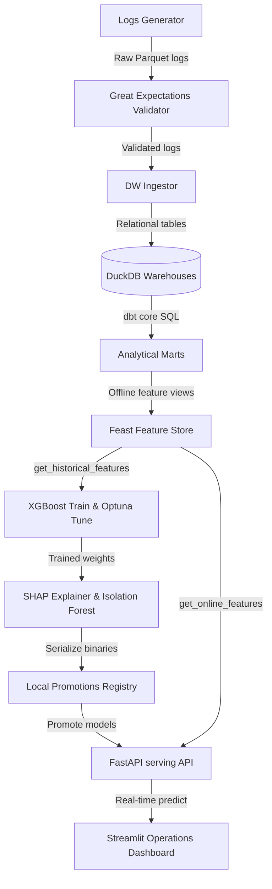

# Google Search Quality Intelligence Platform

## Predicting Search Quality Degradation Before Users Notice

---

## 1. Project Overview & Objective

This platform is a production-grade analytics repository designed to identify micro-degradations in Google Search quality (ranking relevance shifts, browser latency delays, device-specific CTR drops) by correlating technical infrastructure indicators with live user engagement behaviors.

---

## 2. Platform Architecture & Data Flow



---

## 3. Directory Layout Map

The project repository utilizes the following structure:
```
.
├── Dockerfile                   # Multi-stage production container build rules
├── Makefile                     # Developer automation commands
├── README.md                    # Project overview & running instructions
├── docker-compose.yml           # Database, API, and Dashboard container specifications
├── requirements.txt             # Pinned dependencies list
├── pyproject.toml               # Black, Ruff, and Mypy configurations
├── .pre-commit-config.yaml      # Pre-commit formatting hooks setup
├── configs/                     # Central YAML configurations and dbt profiles
│   ├── base_config.yaml         # Base application settings
│   └── dev_config.yaml          # Developer override settings
├── dags/                        # Apache Airflow orchestration DAG files
│   └── search_quality_dag.py
├── data/                        # Local database storage (Parquet event records)
├── models/                      # Registered model weights and JSON registry index
├── src/                         # Core Python applications codebase
│   ├── config/                  # Configuration loader
│   ├── data/                    # Synthetic logs and DW ingestion modules
│   ├── features/                # Feast Feature Store definitions and materialization
│   ├── models/                  # ML training and interpretability scripts
│   ├── serving/                 # FastAPI microservice endpoints
│   └── dashboard/               # Streamlit application
└── tests/                       # Unit and integration test suites
```

---

## 4. Operational Runbook

### Step 1: Local Environment Bootstrap
Ensure you have Python 3.10+ and virtual environment settings compiled. Run bootstrap checks to verify dependencies:
```bash
make bootstrap
```

### Step 2: Ingest & Model Data Warehouse
Generate raw search log events, run Great Expectations quality checks, and ingest into the DuckDB relational warehouse. Run the dbt core models compile and parse commands:
```bash
# 1. Generate logs and validate schema expectations
python3 src/data/generate_logs.py
python3 src/data/validate_data.py

# 2. Ingest conformed dimensional tables into DuckDB warehouse
python3 src/data/ingest_dw.py
```

### Step 3: Compile MLOps Feature Store
Compute rolling CTRs, average dwell times, and latency percentiles, compile Feast schemas, and materialize features into the SQLite online index:
```bash
python3 src/features/register_features.py
```

### Step 4: Train & Optimize ML Models
Build the historical training matrix using Feast offline features, run Optuna hyperparameter tuning sweeps to fit the XGBoost predictor, generate SHAP attributions, train the anomaly Isolation Forest, and register model version weights:
```bash
# 1. Retrain XGBoost SQS model
python3 src/models/train_model.py

# 2. Compute SHAP explanations, fit anomaly detector, and write registry
python3 src/models/explain_model.py
```

### Step 5: Launch FastAPI Serving Backend
Deploy the FastAPI prediction server:
```bash
uvicorn src.serving.api:app --host 0.0.0.0 --port 8000 --reload
```
Test endpoints health:
```bash
curl -X GET http://localhost:8000/health
```

### Step 6: Launch Streamlit Dashboard Portal
Visualize operational metrics and interact with the serving backend using the Streamlit app:
```bash
streamlit run src/dashboard/app.py
```

---

## 5. Verification & Tests
Verify code formatting and static type constraints:
```bash
make lint
make type-check
```
Run the full test suite including serving API clients assertions:
```bash
PYTHONPATH=. /Users/jerry/venv/bin/pytest tests/
```
