# Governance: Risk Register & Dependency Matrix

This document defines the project governance guidelines, tracks critical risks, and maps technical dependencies.

---

## 1. Risk Register

We assess project risks using the standard risk matrix formula:

> **Risk Score = Likelihood × Impact**

Where Likelihood and Impact are scored on a scale of 1 (Low) to 5 (Critical). Any score ≥ 12 is categorized as a **High Priority Risk** requiring a formalized mitigation and contingency plan.

| Risk ID | Risk Description | Likelihood (1-5) | Impact (1-5) | Score (1-25) | Mitigation Plan (Proactive) | Contingency Plan (Reactive) | Owner |
| :--- | :--- | :---: | :---: | :---: | :--- | :--- | :--- |
| **RSK-101** | **Concept Drift**: User search behavior shift causes prediction score accuracy degradation. | 4 | 4 | **16** | Schedule automated weekly Kolmogorov-Smirnov drift tests comparing new data to training data. | Trigger the automated retraining Airflow DAG to update model weights. | Staff MLE |
| **RSK-102** | **PII Leakage**: Search query logs contain sensitive user details violating privacy compliance. | 2 | 5 | **10** | Enforce salted SHA256 hashing on IPs/User IDs at the ingestion boundary. | Truncate raw logs table, purge audit backups, and report to Privacy Officer. | Lead Security |
| **RSK-103** | **Alert Fatigue**: False positives in anomaly detection cause SREs to ignore alerts. | 4 | 3 | **12** | Calibrate anomaly contamination parameters using rolling Z-scores instead of static limits. | Implement alert grouping and routing rules in Alerter class. | Lead SRE |
| **RSK-104** | **Inference Bottleneck**: SHAP calculations or XGBoost scoring delays search query response times. | 3 | 4 | **12** | Decouple scoring from user-facing search loops; serve SQS scores asynchronously. | Implement a fallback heuristic or serve cached SQS scores if latency > 50ms. | Staff SWE |
| **RSK-105** | **Synthetic Data Realism**: ML model overfits on synthetic trends, failing on real-world logs. | 3 | 4 | **12** | Profile synthetic outputs against anonymized empirical statistics provided by stakeholders. | Re-calibrate the generator distributions (Poisson, Beta) and retrain. | Lead DS |
| **RSK-106** | **Pipeline Ingestion Failure**: Network latency causes daily Parquet ingest tasks to drop. | 3 | 3 | **9** | Configure Airflow tasks to auto-retry 3 times with exponential backoff. | Alert SRE on Slack and freeze dbt run to prevent downstream metrics pollution. | Lead DE |
| **RSK-107** | **Database Lockups**: Heavy dashboard SELECT queries lock dbt write operations. | 2 | 4 | **8** | Materialize dashboard models as views on incremental tables; implement query caches. | Terminate locking sessions and scale up database connections pool limit. | Lead DE |
| **RSK-108** | **Model Overfitting**: Multi-collinearity among engineered features creates unstable weights. | 3 | 3 | **9** | Calculate VIF metrics and drop collinear features with VIF > 5 before training. | Re-run recursive feature elimination (RFE) to prune feature set. | Lead DS |

---

## 2. Dependency Matrix & Critical Path

To establish a clear execution sequence, we map the hard dependencies (pre-requisites) across the development phases.

```mermaid
graph TD
    M9["M9: Repo & Docker Setup"] --> M10["M10: Linters & Pre-Commit"]
    M10 --> M11["M11: Config Loader"]
    
    M11 --> M12["M12: Data Generator Design"]
    M12 --> M13["M13: Data Generator Script"]
    M13 --> M14["M14: 1M Row Scale Optimization"]
    
    M14 --> M15["M15: Database Schema & Bulk Ingest"]
    M15 --> M16["M16: Great Expectations Validation"]
    M16 --> M17["M17: dbt Project Setup"]
    M17 --> M18["M18: dbt Staging Models"]
    
    M18 --> M19["M19: dbt Core Fact/Dim Tables"]
    M19 --> M20["M20: Sessionization Metrics SQL"]
    M20 --> M21["M21: Incremental Loading Setup"]
    
    M21 --> M22["M22: Airflow Environment Setup"]
    M22 --> M23["M23: Orchestrated DAG pipeline"]
    
    M23 --> M24["M24: Feature Store Definitions"]
    M24 --> M25["M25: 100+ Features Pipeline"]
    
    M25 --> M26["M26: EDA Notebooks"]
    M26 --> M27["M27: Statistical Hypotheses Tests"]
    M26 --> M28["M28: Collinearity (VIF) check"]
    
    M28 --> M29["M29: Time-Split & Baseline Model"]
    M29 --> M30["M30: XGBoost Model Training"]
    M30 --> M31["M31: Residual Error Analysis"]
    M31 --> M32["M32: SHAP Explainability"]
    M32 --> M33["M33: Isolation Forest Anomaly Engine"]
    
    M33 --> M34["M34: Drift Detection Tests"]
    M34 --> M35["M35: Continuous Retrain DAG"]
    M35 --> M36["M36: FastAPI Inference Container"]
    
    M36 --> M37["M37: Power Calculator Design"]
    M37 --> M38["M38: SRM Test Implementation"]
    M38 --> M39["M39: Experiment Analyzer"]
    
    M39 --> M40["M40: Hashing & Masking Filters"]
    M40 --> M41["M41: Data Catalog & Lineage Graph"]
    M41 --> M42["M42: Responsible AI Bias Audit"]
    
    M42 --> M43["M43: Dashboard Mockup Wireframes"]
    M43 --> M44["M44: Streamlit UI App Ingest"]
    M44 --> M45["M45: Slack Webhook Alerter"]
    
    M45 --> M48["M48: Pytest Suite & CI Setup"]
    M48 --> M49["M49: Developer Setup Guides"]
    M49 --> M50["M50: Executive Slide Deck Presentation"]

    style M9 fill:#f9f,stroke:#333,stroke-width:2px
    style M23 fill:#bbf,stroke:#333,stroke-width:2px
    style M36 fill:#bfb,stroke:#333,stroke-width:2px
    style M44 fill:#fbb,stroke:#333,stroke-width:2px
    style M50 fill:#ff9,stroke:#333,stroke-width:2px
```

### Critical Path Method (CPM) Analysis
The critical path for this project is:
`Repo Initialization (M9) ➔ Synthetic Data (M13-14) ➔ SQL Warehouse (M15-18) ➔ Metrics Transformations (M19-21) ➔ Ingestion Orchestration (M23) ➔ Feature Engineering (M25) ➔ Modeling & SHAP (M29-32) ➔ API Deployment (M36) ➔ Streamlit Dashboard (M44) ➔ Tests & Handover (M48-50)`.

*   **Hard Dependencies**: You cannot execute machine learning training (M30) without the feature engineering pipeline (M25), which relies on clean database records (M19).
*   **Soft Dependencies (Parallel Work)**: The A/B testing statistical framework (M37-39) can be developed in parallel with model serving APIs (M36) as long as database metric staging models are finalized.
