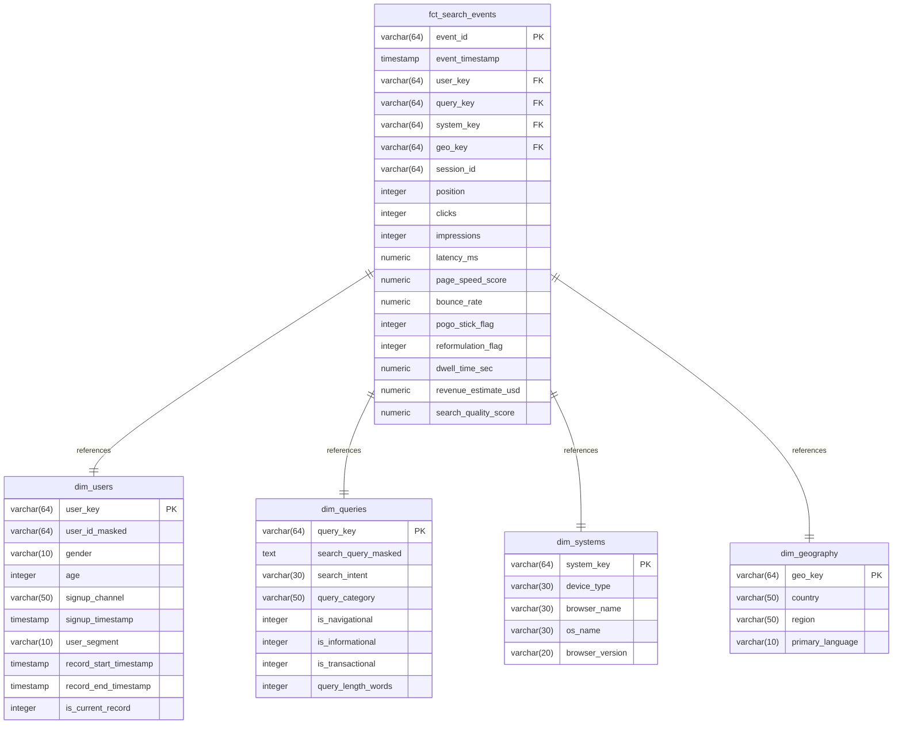

# Data Warehouse & Schema Modeling Design

This document details the database modeling, schema design, indexing, and partitioning strategy for the Google Search Quality Intelligence Platform.

---

## 1. Schema Selection: Star Schema

For our analytical warehouse, we select a **Star Schema** configuration. 
- **Why**: Star schemas minimize join paths, making queries simple to write and highly performant for analytical tools (dbt, Streamlit). In modern cloud warehouses like BigQuery, denormalization inside dimensions is highly preferred over Snowflake normalization because column-store engines execute scans faster than complex multi-table joins.

---

## 2. Entity-Relationship Diagram (ERD)

The warehouse centers around the main search transactions fact table (`fct_search_events`) linked to four descriptive dimension tables.



---

## 3. Data Dictionary

### Fact Table: `fct_search_events`
Stores individual search transaction events.

| Column | Data Type | Constraint | Description |
| :--- | :--- | :--- | :--- |
| `event_id` | `VARCHAR(64)` | `PRIMARY KEY` | Cryptographic hash unique to the search event. |
| `event_timestamp` | `TIMESTAMP` | `NOT NULL` | The exact UTC timestamp of the search action. |
| `user_key` | `VARCHAR(64)` | `FOREIGN KEY` | Key joining to `dim_users` table. |
| `query_key` | `VARCHAR(64)` | `FOREIGN KEY` | Key joining to `dim_queries` table. |
| `system_key` | `VARCHAR(64)` | `FOREIGN KEY` | Key joining to `dim_systems` table. |
| `geo_key` | `VARCHAR(64)` | `FOREIGN KEY` | Key joining to `dim_geography` table. |
| `session_id` | `VARCHAR(64)` | `NOT NULL` | Session identifier computed using 30-min inactivity limits. |
| `position` | `INTEGER` | `CHECK (position >= 0)` | The average position of user clicks during the event. |
| `clicks` | `INTEGER` | `CHECK (clicks >= 0)` | Total number of click actions on results. |
| `impressions` | `INTEGER` | `CHECK (impressions >= 1)` | Total search results displayed. |
| `latency_ms` | `NUMERIC` | `CHECK (latency_ms >= 0)` | Search engine response latency in milliseconds. |
| `page_speed_score` | `NUMERIC` | `CHECK (page_speed_score BETWEEN 0 AND 100)` | Mobile-friendly rendering index score. |
| `bounce_rate` | `NUMERIC` | `CHECK (bounce_rate BETWEEN 0 AND 1)` | Session bounce probability. |
| `pogo_stick_flag` | `INTEGER` | `CHECK (pogo_stick_flag IN (0, 1))` | 1 if user returned to SERP in < 5 seconds; else 0. |
| `reformulation_flag` | `INTEGER` | `CHECK (reformulation_flag IN (0, 1))` | 1 if query was modified in session; else 0. |
| `dwell_time_sec` | `NUMERIC` | `CHECK (dwell_time_sec >= 0)` | Time spent on target result page. |
| `revenue_estimate_usd`| `NUMERIC` | `CHECK (revenue_estimate_usd >= 0)` | Estimated ad revenue generated by this query. |
| `search_quality_score`| `NUMERIC` | `CHECK (search_quality_score BETWEEN 0 AND 100)` | Predicted Search Quality metric. |

### Dimension Table: `dim_users`
Tracks user metadata using Slowly Changing Dimension Type 2 (SCD Type 2).

| Column | Data Type | Constraint | Description |
| :--- | :--- | :--- | :--- |
| `user_key` | `VARCHAR(64)` | `PRIMARY KEY` | Hash combining User ID and record timestamp. |
| `user_id_masked` | `VARCHAR(64)` | `NOT NULL` | Cryptographically salted user identifier. |
| `gender` | `VARCHAR(10)` | - | User demographic gender. |
| `age` | `INTEGER` | - | User age. |
| `signup_channel` | `VARCHAR(50)` | - | Original channel (e.g. Organic, Paid). |
| `signup_timestamp` | `TIMESTAMP` | - | Date user created their Google account. |
| `user_segment` | `VARCHAR(10)` | - | User value cohort class (e.g. Heavy, Light). |
| `record_start_timestamp`| `TIMESTAMP` | `NOT NULL` | Validity start timestamp for SCD Type 2 record. |
| `record_end_timestamp` | `TIMESTAMP` | - | Validity end timestamp. Null if active. |
| `is_current_record` | `INTEGER` | `CHECK (is_current_record IN (0, 1))` | 1 if active current row; else 0. |

### Dimension Table: `dim_queries`
Describes the search query and classification details.

| Column | Data Type | Constraint | Description |
| :--- | :--- | :--- | :--- |
| `query_key` | `VARCHAR(64)` | `PRIMARY KEY` | Unique surrogate key generated from query string. |
| `search_query_masked` | `TEXT` | `NOT NULL` | Masked query string (sensitive terms redacted). |
| `search_intent` | `VARCHAR(30)` | - | Intent class (e.g., Transactional, Informational). |
| `query_category` | `VARCHAR(50)` | - | Broad subject category (e.g., Tech, Finance, Health). |
| `is_navigational` | `INTEGER` | `CHECK (is_navigational IN (0, 1))` | 1 if target is navigational; else 0. |
| `is_informational` | `INTEGER` | `CHECK (is_informational IN (0, 1))` | 1 if informational; else 0. |
| `is_transactional` | `INTEGER` | `CHECK (is_transactional IN (0, 1))` | 1 if transactional; else 0. |
| `query_length_words` | `INTEGER` | `CHECK (query_length_words > 0)` | Word count of the query string. |

### Dimension Table: `dim_systems`
Captures technical user agent details.

| Column | Data Type | Constraint | Description |
| :--- | :--- | :--- | :--- |
| `system_key` | `VARCHAR(64)` | `PRIMARY KEY` | Surrogate key computed from system attributes. |
| `device_type` | `VARCHAR(30)` | `NOT NULL` | Client device class (Mobile, Desktop, Tablet). |
| `browser_name` | `VARCHAR(30)` | `NOT NULL` | Browser application (Chrome, Safari, Firefox). |
| `os_name` | `VARCHAR(30)` | `NOT NULL` | OS platform (Android, iOS, Windows, macOS). |
| `browser_version` | `VARCHAR(20)` | - | Build version of the client browser. |

### Dimension Table: `dim_geography`
Describes geographic properties of the query source.

| Column | Data Type | Constraint | Description |
| :--- | :--- | :--- | :--- |
| `geo_key` | `VARCHAR(64)` | `PRIMARY KEY` | Surrogate key computed from country/region names. |
| `country` | `VARCHAR(50)` | `NOT NULL` | Country name (e.g., United States, Japan). |
| `region` | `VARCHAR(50)` | `NOT NULL` | State, province, or prefecture. |
| `primary_language` | `VARCHAR(10)` | `NOT NULL` | Standard ISO language code. |

---

## 4. Partitioning, Indexing & Clustering Strategy

### Partitioning Strategy
For our relational warehouse, `fct_search_events` is **partitioned by Date** derived from the `event_timestamp` column.
- **Why**: 95% of search analysis queries run on date ranges (e.g., last 7 days or comparison of today vs. yesterday). Partitioning ensures that the query planner ignores historical partitions, drastically minimizing disk reading latency.

### Indexing Strategy
To optimize analytical joins, we apply the following indexes:
1.  **Primary Key Indexes**: Default B-Tree indexes created on all table primary keys.
2.  **Foreign Key Indexes**: B-Tree indexes on `fct_search_events` foreign keys (`user_key`, `query_key`, `system_key`, `geo_key`) to speed up join operations.
3.  **Filtered Index (Partial Index)**: A partial index on `dim_users` for active records:
    ```sql
    CREATE INDEX idx_dim_users_active ON dim_users (user_id_masked) WHERE is_current_record = 1;
    ```
    This indexes only active user profiles, keeping index sizes small and speeding up user dimension lookups during daily incremental ETL.

### Clustering Strategy
For high-scale cloud warehouses, we select **Clustering on `country` and `device_type`**.
- **Why**: Queries filtering by specific regions (e.g., US mobile traffic vs. JP desktop traffic) will read co-located rows, reducing data scanning cost and execution time.
