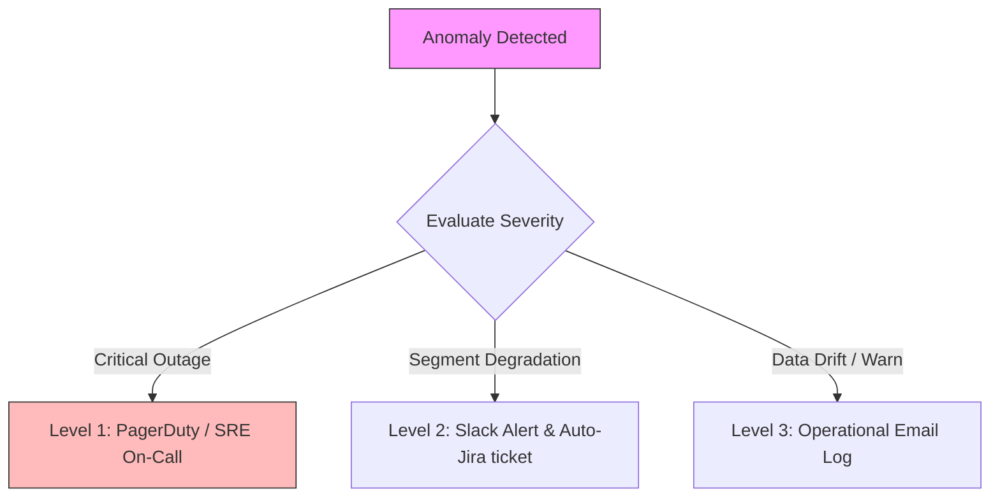

# Monitoring & Visualization Architecture Design

This document details the visual interface specifications, dashboard hierarchy, and system observability design for the Google Search Quality Intelligence Platform.

---

## 1. Dashboard UI Hierarchy & Wireframes

The analytical interface consists of three distinct multi-page dashboard modules targeting different user personas defined in Phase 1:

```
┌────────────────────────────────────────────────────────┐
│               SEARCH QUALITY PORTAL                   │
├───────────────┬────────────────────────┬───────────────┤
│ Executive View│ Operational view (Ops) │ MLOps View    │
│ (Strategic)   │ (Technical Debugging)  │ (Model Health)│
└───────────────┴────────────────────────┴───────────────┘
```

### 1. Page A: Strategic Executive View
*   **Primary User**: Director of Search Product.
*   **Core Metrics**: Predicted Search Quality Score (SQS) trend, Estimated Revenue at Risk, Total Click Volume, Global Average Latency.
*   **Visual Layout**:
    *   *Row 1 (KPI Cards)*: Single Value Cards displaying current SQS, 24h change, and projected ad revenue impact of degradations.
    *   *Row 2 (Main Trend)*: Line chart illustrating SQS alongside latency anomalies over a rolling 90-day window.
    *   *Row 3 (Geographic Heatmap)*: Regional map showing SQS quality distribution.

### 2. Page B: Technical Operations View
*   **Primary User**: Regional Search Quality Analysts, SREs.
*   **Core Metrics**: P50/P90/P99 latency, Bounce Rate, Pogo-Sticking rate, Reformulation index split by Device and Browser.
*   **Visual Layout**:
    *   *Row 1 (Segment Selectors)*: Filters for Country, Browser, Operating System, and Device.
    *   *Row 2 (Core Correlation Plots)*: Dual-axis charts plotting average latency vs. CTR to visually diagnose latency correlation drops.
    *   *Row 3 (Active Alert Table)*: Logs containing unresolved quality anomalies.

### 3. Page C: MLOps & Data Quality View
*   **Primary User**: Machine Learning Engineers.
*   **Core Metrics**: Kolmogorov-Smirnov drift p-values, Population Stability Index (PSI), target score distribution shifts, Great Expectations load status checks.
*   **Visual Layout**:
    *   *Row 1 (Data Quality Pipeline Summary)*: Color-coded green/red grid indicating status of daily table validation expectations.
    *   *Row 2 (Feature Drift Heatmap)*: Grid displaying PSI scores for the top 20 model features.
    *   *Row 3 (Model Accuracy Logs)*: Running line chart showing MAE and baseline comparisons over training runs.

---

## 2. Observability & Alerting Framework

Observability follows Google's **Site Reliability Engineering (SRE) Golden Signals**: Latency, Traffic, Errors, and Saturation.

### 1. Service Level Indicators (SLIs) & Objectives (SLOs)

We establish strict operational targets for our pipelines and serving APIs:

| Component | SLI Definition | SLO Target | Alert Trigger (Critical) |
| :--- | :--- | :--- | :--- |
| **Model API** | Latency of the `/predict` endpoint for a single payload request. | P99 Latency $\le$ 50ms over a 30-day window. | P99 Latency > 150ms for more than 5 consecutive minutes. |
| **Model API** | Error rate (5xx HTTP status codes returned). | $\le$ 0.1% of daily incoming requests. | Error rate > 1.5% in a rolling 10-minute window. |
| **Data Warehouse** | Data Freshness (time since the last successful daily load). | Update complete by 06:00 UTC daily. | Last update timestamp > 30 hours ago. |
| **Data Quality** | % of Great Expectations checks that pass on ingestion. | 100% of critical assertions pass. | Any critical validation rule fails (halts load). |

### 2. Alert Routing & Escalation Protocol

Alert notifications are processed asynchronously to prevent flooding:



---

## 3. Data Quality & Model Drift Monitoring

Monitoring is implemented at the **boundaries** of our systems:

### 1. Data Quality Boundaries
*   **Staging Load Validation**: Great Expectations runs constraints checks on raw log shapes. If fields violate constraints (e.g. CTR is outside `[0.0, 1.0]`), the ingestion job halts, locking the staging table to prevent corrupt records from polluting analytical aggregates.

### 2. Model Drift Monitoring
*   **Statistical Drift Engine**: A weekly cron job calculates Kolmogorov-Smirnov (KS) tests comparing the active inference feature distributions against training data profiles.
*   **Actionable Retraining Triggers**: If more than 5 core features show severe drift (PSI > 0.25) or the predicted output SQS distribution shifts (KS test p-value < 0.05), an automated retraining DAG is triggered in Apache Airflow to recalibrate model parameters.
