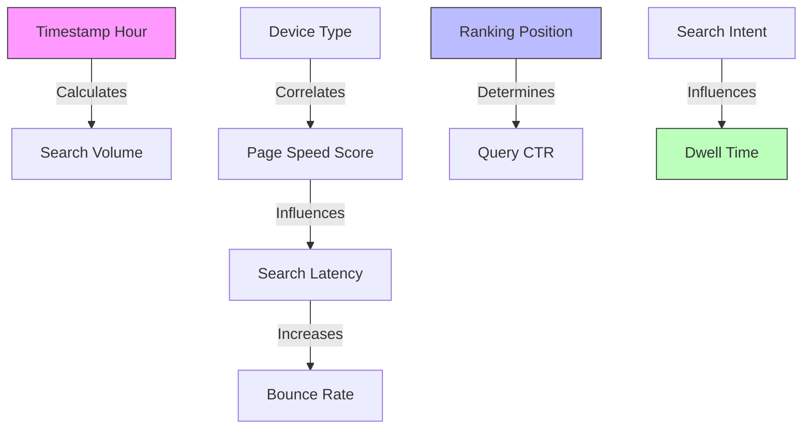

# Synthetic Search Log Generator Design

This document details the statistical design, probability distributions, dependency rules, and diurnal cycles used to generate realistic synthetic search event logs for the Google Search Quality Intelligence Platform.

---

## 1. Probability Distributions Map

To prevent generating flat, uniform, or statistically meaningless synthetic data, every field in our search log dataset is modeled using a specific empirical distribution:

| Variable Class | Metric Name | Statistical Distribution | Distribution Parameters | Rationale |
| :--- | :--- | :--- | :--- | :--- |
| **Volume** | Hourly Query Counts | **Poisson** | $\lambda = \text{hourly\_average}$ | Represents independent events occurring at a constant average rate. |
| **System** | Search Latency (`latency_ms`) | **Lognormal** | $\mu = 4.8$, $\sigma = 0.5$ | Latency is non-negative and highly right-skewed (most queries are fast, few tail queries are very slow). |
| **System** | Page Speed Score | **Beta** | $\alpha = 8.0$, $\beta = 2.0$ | Bounded between 0 and 100. Skewed towards high performance (90+ score). |
| **Behavior** | Click-Through Rate (CTR) | **Beta** | $\alpha$ and $\beta$ derived from query position | Bounded between 0.0 and 1.0. Skewed heavily based on ranking position. |
| **Behavior** | Dwell Time (`dwell_time_sec`) | **Gamma** | $k = 2.0$, $\theta = 30.0$ | Bounded at zero, peaking at 45s, with a long right tail for long-form reading. |
| **Behavior** | Bounce Rate | **Beta** | $\alpha$ and $\beta$ derived from latency | Bounded between 0.0 and 1.0. Correlated directly with latency spikes. |

---

## 2. Diurnal Traffic Cycle Wave Design

Search traffic follows a natural 24-hour cycle corresponding to human sleeping and waking periods. We model the hourly traffic rate ($\lambda_t$) using a sinusoidal wave offset:

$$\lambda_t = \text{base\_volume} \times \left(1 + A \times \sin\left(\frac{2\pi \times (t - \phi)}{24}\right)\right)$$

Where:
- $t$: Hour of the day (0 to 23).
- $\text{base\_volume}$: Average hourly search logs volume (e.g., 50,000 queries).
- $A$: Amplitude of the wave (set to 0.4, allowing volume to fluctuate by $\pm 40\%$).
- $\phi$: Phase shift (set to 8, aligning peak search traffic around 14:00/2 PM and lowest traffic around 4:00 AM).

```
Traffic Volume Index
  1.4 |          _.._
  1.2 |        .'    '.
  1.0 |      .'        '.
  0.8 |    .'            '.
  0.6 |  .'                '._
  0.4 | '                     '
      +-------------------------
      0   4   8   12  16  20  24  Hour (UTC)
```

---

## 3. Dependency & Correlation Rules

To train predictive models successfully, we enforce mathematical dependencies across fields. The generator implements the following calculations sequentially:



### 1. Position-Based CTR Drop
Click-Through Rate decays exponentially as ranking position increases:
$$\text{CTR}_{\text{base}} = 0.45 \times e^{-0.35 \times (\text{position} - 1)}$$
- If `position = 1`: $\text{CTR}_{\text{base}} = 45\%$.
- If `position = 3`: $\text{CTR}_{\text{base}} = 22\%$.
- If `position = 10`: $\text{CTR}_{\text{base}} = 1.9\%$.
*Implementation*: The final event click decision is drawn from a Bernoulli trial with $p = \text{CTR}_{\text{base}}$.

### 2. Latency-Induced Bounce Rate
Bounce probability increases as latency grows:
$$\text{Bounce Rate} = \text{clip}\left(\text{base\_bounce} + 0.15 \times \ln\left(\frac{\text{latency\_ms}}{100}\right), 0.05, 0.95\right)$$
- Normal latency (100ms): Bounce rate is $\text{base\_bounce}$ (~20%).
- Slow latency (1000ms): Bounce rate increases by $+34.5\%$ (yielding ~54.5%).

### 3. Intent-Driven Dwell Time
- **Navigational Intent** (e.g. "amazon"): Low dwell time (Mean: 10s, SD: 5s). Users click and leave the search engine.
- **Informational Intent** (e.g. "how to repair car engine"): Long dwell time (Mean: 180s, SD: 90s). Users spend minutes reading.
- **Transactional Intent** (e.g. "buy ticket online"): Moderate dwell time (Mean: 60s, SD: 25s).

### 4. Search Quality Score (SQS) (Target Variable)
The target SQS score (0–100) is calculated as a composite index representing satisfaction, penalized by technical failures:
$$\text{SQS}_{\text{raw}} = 100 - (\text{position} \times 2.5) - (\text{reformulation\_flag} \times 15) - (\text{pogo\_stick\_flag} \times 20) - \text{penalties}$$
Where:
- $\text{penalties} = 10 \times \ln(\text{latency\_ms} / 150)$ if $\text{latency\_ms} > 150$; else 0.
- Standard Gaussian noise ($\mathcal{N}(0, 2)$) is added to represent unmodeled user variances.
