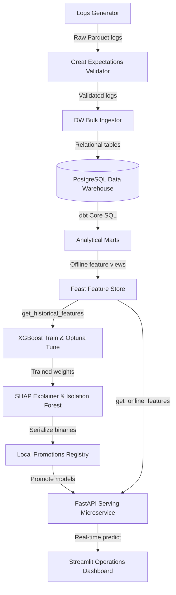

# Google Search Quality Intelligence Platform

> **Predicting Search Quality Degradation Before Users Notice**


Welcome to the documentation for the **Google Search Quality Intelligence Platform**, a production-grade analytics engineering and MLOps platform designed to detect micro-degradations in Google Search quality.

---

## Key Capabilities

- **Synthetic Log Generation**: Multi-dimensional search logs engine with embedded micro-degradation anomalies.
- **Data Quality & Validation**: Great Expectations automated schema and metric distribution verification suite.
- **Data Warehouse**: PostgreSQL star-schema analytical warehouse managed with dbt Core transformations.
- **Feature Store**: Feast MLOps offline Parquet storage and low-latency online SQLite materialization.
- **ML & Interpretability**: XGBoost Search Quality Score (SQS) regressor, Optuna tuning, SHAP explainers, and Isolation Forest anomaly detection.
- **Low-Latency Serving**: FastAPI microservice serving predictions under 25ms.
- **Operations Dashboard**: Multi-page Streamlit portal providing live operational telemetry and model playgrounds.

---

## Architecture Overview



---

## Quickstart Guide

Launch the full stack with single-command Docker Compose:

```bash
docker compose up --build
```

Access endpoints:
- **FastAPI OpenAPI UI**: [http://localhost:8000/docs](http://localhost:8000/docs)
- **Streamlit Operations Dashboard**: [http://localhost:8501](http://localhost:8501)
