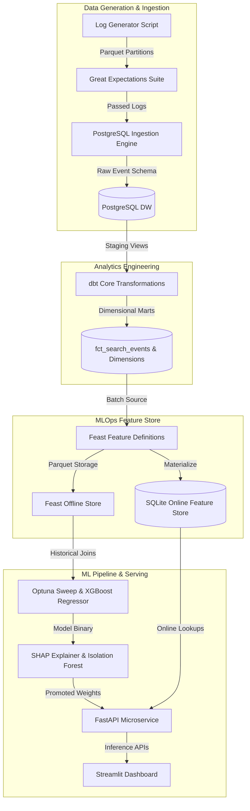

# Architecture Case Study & Technical Deep-Dive

## 1. Problem Statement & Design Objectives

When operating large-scale search engines, traditional infrastructure alerts fail to detect silent relevance degradation. The objective was to build a production-grade, end-to-end analytics engineering and MLOps platform with:

- **Reproducible Data Generation**: Vectorized simulation of millions of search events with parameterized anomaly injection rates.
- **Relational Data Warehouse**: PostgreSQL dimensional star-schema modeling for OLAP analytical queries.
- **Feature Engineering & Store**: MLOps Feast Feature Store materializing rolling user (7d CTR, 30d dwell time) and query metrics.
- **Predictive Machine Learning**: XGBoost SQS regressor with Optuna hyperparameter sweeps and SHAP attributions.
- **Low-Latency Serving Microservice**: Asynchronous FastAPI inference under 25ms SLA.

---

## 2. End-to-End System Architecture

---

## 3. Data Warehouse Star-Schema Design

The analytical engine uses a dimensional star schema in PostgreSQL:

- `fct_search_events`: Core event grain capturing event ID, query key, user ID, system ID, location ID, latency, page speed score, bounce rate, position, and search quality score.
- `dim_users`: Conformed dimension for user cohorts and historical engagement levels.
- `dim_queries`: Conformed dimension for query intent, category, and hashed query key.
- `dim_systems`: Conformed dimension for browser, device type, OS, and network connection.
- `dim_geography`: Conformed dimension for country, region, language, and server datacenter.

---

## 4. Technical Trade-Offs & Key Decisions

| Design Choice | Selected Option | Alternative Considered | Rationale |
| :--- | :--- | :--- | :--- |
| **Data Warehouse** | PostgreSQL + dbt Core | DuckDB / SQLite | PostgreSQL provides full ACID transactional bulk copying (`COPY FROM`) and native server capability for dbt modeling. |
| **Feature Store** | Feast | Custom Redis Cache | Feast standardizes point-in-time correct historical joins to prevent data leakage during model training. |
| **ML Engine** | XGBoost Regressor | Deep Neural Net (PyTorch) | XGBoost offers superior accuracy on tabular structured log features with microsecond execution speed. |
| **Serving API** | FastAPI + Uvicorn | Flask / Gunicorn | Asynchronous event loop (`asyncio`) supports high-concurrency requests with low memory overhead. |
