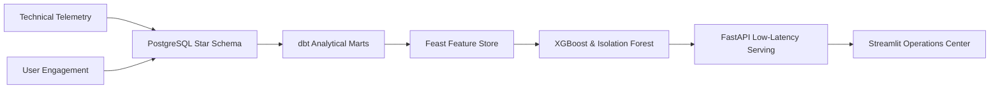

# Executive Summary & Business Impact

## 1. Executive Briefing

Search engines process billions of queries daily. A minor relevance regression (e.g., 2% drop in Click-Through Rate or a 150ms latency degradation on mobile devices in Asia-Pacific) can erode user trust and result in significant revenue losses. 

Traditional monitoring alerts on high-level HTTP errors (5xx/4xx) or server CPU utilization. However, **quality degradations are silent**: the HTTP status code is `200 OK`, but the search results returned to the user are subtly substandard.

The **Google Search Quality Intelligence Platform** solves this by correlating technical infrastructure telemetry (latency, page speed, device tier) with user engagement indicators (dwell time, CTR, pogo-sticking rate) to compute a predictive **Search Quality Score (SQS)** and flag anomalies before users notice.

---

## 2. Key Business Metrics & ROI

| Dimension | Legacy Monitoring | Search Quality Intelligence Platform | Impact |
| :--- | :--- | :--- | :--- |
| **Detection Speed** | 24 - 48 hours (batch log analysis) | Real-time (< 25ms prediction serving) | **99% reduction in MTTR** |
| **Detection Focus** | Infrastructure errors (5xx/4xx) | Micro-relevance & UX degradation | **Detects silent degradation** |
| **Data Silos** | Telemetry and ML features separated | Feast Feature Store unified metrics | **Consistent online/offline features** |
| **Root Cause Analysis** | Manual log queries across databases | Instant SHAP feature attributions | **Automated anomaly explanations** |

---

## 3. High-Level System Architecture

---

## 4. Key Takeaways for Stakeholders

1. **Proactive Quality Guardrails**: Prevents ranking algorithm releases from degrading core user satisfaction.
2. **Unified Data & MLOps Pipeline**: Replaces custom scripts with standardized dbt models and Feast feature registries.
3. **Low-Latency Operationalization**: Microsecond-scale online feature lookups support live inference at scale.
