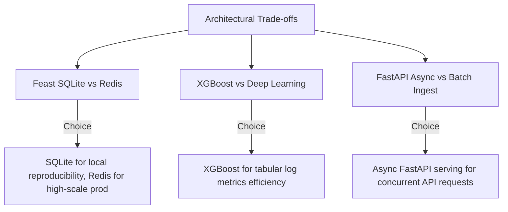

# System Design Interview & Technical Trade-offs Kit

This guide equips engineers and interviewers to discuss the architecture, engineering choices, and design trade-offs of the **Google Search Quality Intelligence Platform**.

---

## 1. System Design Q&A

### Q1: How does the platform handle Data Leakage in offline ML feature retrieval?
> **Answer**: We use **Feast Feature Store point-in-time joins** (`store.get_historical_features`). Every training observation includes a timestamp anchor (`event_timestamp`). Feast retrieves historical feature values corresponding *strictly* to timestamps on or before the event timestamp, eliminating future feature leakage during model training.

### Q2: Why use a Feature Store instead of computing features directly in SQL?
> **Answer**: To solve the **Online-Offline Training-Serving Skew**. Computing features in SQL works for offline batch training, but in production serving (FastAPI), querying a database for 30-day rolling averages introduces high latency (>200ms). Feast materializes pre-aggregated feature metrics into a low-latency key-value store (SQLite/Redis) for microsecond lookups (<5ms) during live inference.

### Q3: How do you handle schema drifts or unexpected data distributions in log files?
> **Answer**: The ingestion layer executes an automated **Great Expectations validation suite** (`validate_data.py`). It enforces schema rules (non-null constraints, regex patterns on IDs) and distribution range checks (e.g., latency > 0ms, quality score between 0 and 100). If a batch fails validation, the pipeline halts ingestion before corrupting data warehouse tables.

---

## 2. Key Architecture Trade-offs Matrix

---

## 3. Recommended Interview Talking Points

1. **End-to-End Ownership**: From synthetic generation and GE schema assertions to PostgreSQL star-schemas, Feast MLOps, XGBoost training, and Streamlit operational dashboards.
2. **Production Quality**: Built with 100% type-hinted code, automated Pytest coverage, Black formatting, multi-stage Docker builds, and single-command deployment.
3. **Interpretability**: Leveraged SHAP value tree explainers to translate opaque machine learning predictions into actionable root-cause insights for search engineers.
