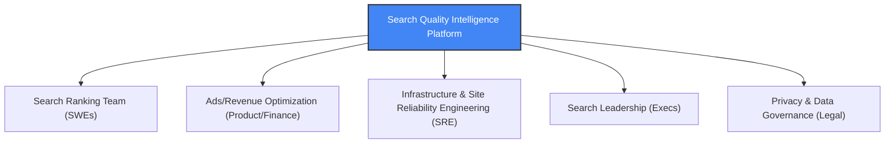

# Problem Definition & Persona Mapping

## 1. Problem Statement: Search Quality Degradation

Google Search processes billions of queries per day. In a system of this scale, search quality issues do not typically manifest as complete site outages. Instead, they occur as **silent regressions**:
- A ranking algorithm update causes a subtle relevancy drop for specific tail-queries.
- A frontend update introduces a 120ms rendering delay on mobile browsers in specific regions, causing users to drop off.
- An increase in "pogo-sticking" behavior (users clicking a search result and immediately returning to the search page) indicating that the clicked pages are not meeting user intent or are loading too slowly.

These micro-degradations are often invisible to traditional infrastructure monitoring (which only reports binary up/down status or global latency averages) but have a massive cumulative impact on user satisfaction, retention, and ad revenue.

### Core Search Metrics vs. User Experience (UX) Metrics
To detect these issues, we must correlate search quality metrics with UX signals:

| Metric Type | Metric Name | Definition | Google Significance |
| :--- | :--- | :--- | :--- |
| **Core Search** | Click-Through Rate (CTR) | Clicks divided by total Impressions. | Primary signal of query relevance and ad placement efficiency. |
| **Core Search** | Average Position | The mean rank of clicked search results. | Lower positions indicate that users must scroll further to find answers. |
| **Core Search** | Reformulation Rate | % of sessions where a user modifies their query. | High rates suggest the initial search results failed to answer the query. |
| **User Experience** | Latency (P50/P90/P99) | Time taken for the search engine to return the page. | Latency directly degrades CTR. A 100ms delay can reduce search volume by 0.2%. |
| **User Experience** | Dwell Time | Duration spent on a clicked search result page. | High dwell time indicates the page successfully satisfied the user's intent. |
| **User Experience** | Pogo-Sticking Rate | % of clicks where user returns to SERP in < 5s. | Strong negative signal indicating irrelevant results or slow loading landing pages. |

---

## 2. Target User Personas

To design an effective interface, we identify three distinct user personas who will interact with the platform.

### Persona A: The Product Analyst
*   **Role**: Senior Search Product Analyst (Trust & Safety Team)
*   **Background**: Statistics, SQL, Python, strong business acumen.
*   **Goals**:
    *   Monitor search quality trends across countries, devices, and search intent categories.
    *   Conduct rapid root-cause analysis when search quality scores drop.
    *   Validate whether ranking changes or infrastructure changes caused metric movements.
*   **Pain Points**:
    *   Currently relies on fragmented dashboards across different teams (latency dashboards are separate from ranking metrics).
    *   No automatic alerts that connect technical anomalies (like latency spikes) to product metrics (like CTR drops).
    *   Hard to quantify the financial impact of search quality drops when presenting to leadership.

### Persona B: The Search Quality SWE
*   **Role**: Staff Software Engineer (Search Ranking Team)
*   **Background**: High-performance C++/Python, machine learning, systems architecture.
*   **Goals**:
    *   Understand how new model deployments affect real-world query quality scores.
    *   Determine if a bug is localized to specific query types (e.g., transactional vs. informational).
    *   Differentiate between an infrastructure issue (e.g., slow backend response) and a ranking issue (e.g., bad top results).
*   **Pain Points**:
    *   Relevancy evaluations are mostly offline (using human rater pools); hard to track live user satisfaction metrics in real-time.
    *   Hard to run ad-hoc feature analysis on live search logs due to massive scale and privacy masking limitations.

### Persona C: The Director of Search Product
*   **Role**: Director of Product Management (Core Search)
*   **Background**: MBA/CS, executive leadership, strategy.
*   **Goals**:
    *   Ensure the "North Star" Search Quality Score remains stable.
    *   Quantify ad revenue risks associated with latency or ranking degradation.
    *   Present clean, visual quality reports to Google Search Leadership during monthly reviews.
*   **Pain Points**:
    *   Overwhelmed by deep technical logs; needs high-level business impact metrics (e.g., "Revenue at Risk: $2.4M due to mobile latency in APAC").
    *   Wants to see the ROI of engineering projects aiming to reduce search latency.

---

## 3. Stakeholder Map & Incentives

We map the key stakeholders who influence or are impacted by the platform.

### Stakeholder Incentives Matrix
1.  **Search Ranking Team**:
    *   *Incentive*: Maximize relevance scores.
    *   *Role*: Model developers. They need deep explainability (SHAP, segmentation) to debug bad query results.
2.  **Ads & Revenue Team**:
    *   *Incentive*: Maximize ad clicks and revenue per search.
    *   *Role*: Revenue owners. They need guardrails ensuring that improvements in search relevance don't cannibalize core ad blocks.
3.  **Infrastructure / SRE Team**:
    *   *Incentive*: Minimize resource costs and maintain server stability.
    *   *Role*: Operational owners. They need to monitor latency, throughput, and error rates to prevent pipeline overload.
4.  **Privacy & Governance Team**:
    *   *Incentive*: Enforce compliance with privacy rules (GDPR, CCPA) and prevent PII leakage.
    *   *Role*: Policy reviewers. They need to ensure that search queries containing sensitive search terms are masked and that user identities are salted.

---

## 4. Stakeholder Communication & Alerting Protocols

To prevent alert fatigue and ensure rapid resolution, we define communication pathways based on anomaly severity.

### Alert Severity and Routing Matrix
-   **Level 1: Critical System Outage (SRE Alert)**
    *   *Trigger*: Global search quality score drops by > 5% or P99 latency exceeds 1,500ms for more than 5 minutes.
    *   *Channels*: PagerDuty, automated Slack channel ping, email to Search Leadership.
    *   *Action*: Revert the latest deployment/ranking model version immediately.
-   **Level 2: Segmented Quality Drop (Analyst / SWE Alert)**
    *   *Trigger*: Search Quality Score drops by > 2% for a specific device-browser combination or a country for > 2 hours.
    *   *Channels*: Jira issue created automatically, daily operations report.
    *   *Action*: Assign to the respective Regional Search Quality Analyst to run root-cause analysis (check for regional network outages or local ranking spam).
-   **Level 3: Operational Warning (Reporting Only)**
    *   *Trigger*: Slow data pipeline updates or minor statistical drifts in search queries.
    *   *Channels*: Dashboard flag, weekly email summary.
    *   *Action*: Queue for weekly pipeline maintenance sprint.
